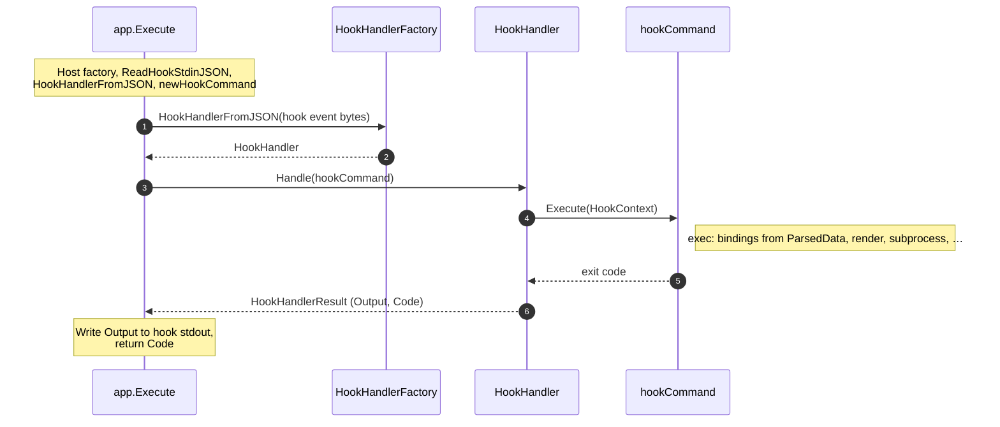
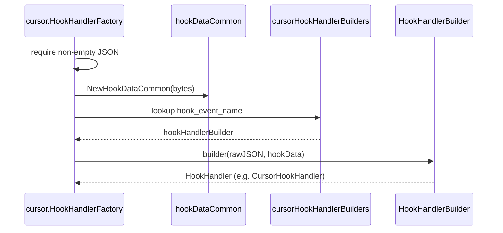
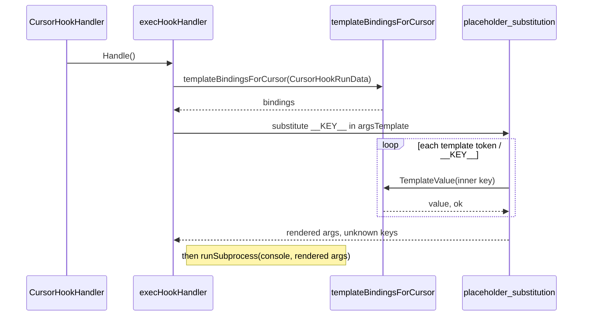

# wat

**wat** is a small tool that accelerates hook writing by taking care of common boilerplate. It reads hook input, passes its data to templated commands or guards, and writes result back to host. It is meant to be:

- **Cross-platform** — runs on Linux, macOS, and Windows.
- **Fast and lightweight** — implemented in Go to have minimal runtime delay.

## Usage

Sample **Cursor** hook configuration (`.cursor/hooks.json`). Adjust the path to `wat` and the child command for your setup.

```json
{
  "version": 1,
  "hooks": {
    "afterFileEdit": [
      {
        "command": "wat cursor exec echo __HOOK_EVENT_NAME__"
      }
    ]
  }
}
```

### `wat <host> exec`

Run a templated hook subprocess: read hook JSON from stdin, substitute allowed `__PLACEHOLDER__` tokens in the command template, run that process, and write the host’s hook protocol line on success. The **first** argument is the hook host (e.g. `cursor`); the **second** is the wat subcommand (`exec`).

```text
Usage:

	wat <host> exec <command> [templated arguments]
	wat <host> exec [-f <re>] <command> [templated arguments]
	wat <host> exec [--file-pattern <re>] <command> [templated arguments]

Options (only for exec, before the subprocess template):

	-f, --file-pattern <re>
	                      Optional; default * means no filter. If you pass a
	                      non-* value, <re> must be non-empty (Go regexp syntax).
	                      When stdin bindings include __FILE_PATH__ (Cursor
	                      afterFileEdit), `exec` skips the subprocess if the path
	                      does not match <re>; other hook events ignore the flag
	                      for matching purposes.
```

Put `-f` / `--file-pattern` after `exec` and before the subprocess command (for example `wat cursor exec -f '[.]go$' …`). Flags are parsed when **`execcommand.NewExecHookHandlerProvider`** builds the provider. If equivalent options are repeated, **the last value wins**.

**Command template** — Everything after the optional flags is one command template: the subprocess program and its arguments. Use only `__PLACEHOLDER__` tokens documented for the current hook event in [Supported Cursor hook types](#supported-cursor-hook-types); any other `__TOKEN__` in the template is an error (exit code `2`).

**Exit status** — If the subprocess is started, wat exits with **that process’s exit code**. Otherwise wat uses own standard [Exit codes](#exit-codes).

### Exit codes

| Code | Meaning |
|------|---------|
| `0` | Success. For `exec`, this means the templated command exited `0`, or `exec` skipped the subprocess because `-f` / `--file-pattern` did not match `__FILE_PATH__`. |
| `1` | General failure — e.g. stdin JSON parse error, host/event rejected the payload, or the subprocess failed to run. |
| `2` | Bad input — invalid CLI usage, unknown host, unknown subcommand, missing `exec` command, unknown `__PLACEHOLDER__`, or nothing left to execute after templating. |

If `exec` **does** start a subprocess, the process exit code may match the child’s code, so `1` or `2` can mean either wat or the child; check stderr for context.

## Supported hosts

- **[Cursor](#cursor)** — supported today.

## Cursor

Cursor supplies hook JSON on stdin. Register hook commands in **`.cursor/hooks.json`**.

### Common Cursor placeholders

| Placeholder | Description |
|-------------|-------------|
| `__CONVERSATION_ID__` | Identifier for the current conversation; taken from the `conversation_id` property of the stdin JSON. |
| `__GENERATION_ID__` | Identifier for the generation step; taken from `generation_id`. |
| `__MODEL__` | Model name for the interaction; taken from `model`. |
| `__HOOK_EVENT_NAME__` | Which hook fired (for example `afterFileEdit`); taken from `hook_event_name`. |
| `__CURSOR_VERSION__` | Cursor app version string; taken from `cursor_version`. |
| `__WORKSPACE_ROOTS__` | Workspace root paths as a single string, joined with `;`; taken from the `workspace_roots` JSON array on stdin. |
| `__USER_EMAIL__` | Signed-in user email when present; taken from `user_email` (empty string if missing or `null`). |
| `__TRANSCRIPT_PATH__` | Transcript file path when present; taken from `transcript_path` (empty string if missing or `null`). |

### Supported Cursor hook types

#### `afterShellExecution`

Fires after a shell command runs in Cursor.

**Placeholders** — [Common Cursor placeholders](#common-cursor-placeholders) plus the additional placeholders below.

| Placeholder | Description |
|-------------|-------------|
| `__COMMAND__` | Full terminal command that Cursor executed; taken from `command`. |
| `__OUTPUT__` | Full terminal output captured by Cursor; taken from `output`. |
| `__DURATION__` | Duration in milliseconds spent executing the shell command; taken from `duration`. |
| `__SANDBOX__` | Whether the command ran in a sandboxed environment (`true` or `false`); taken from `sandbox`. |

**Returns** `{}`.

#### `afterMCPExecution`

Fires after MCP execution.

**Placeholders** — [Common Cursor placeholders](#common-cursor-placeholders).

**Returns** `{}`.

#### `afterFileEdit`

Fires after a file edit.

**Placeholders** — [Common Cursor placeholders](#common-cursor-placeholders) plus:

| Placeholder | Description |
|-------------|-------------|
| `__FILE_PATH__` | Absolute path of the edited file; taken from `file_path`. |

**Returns** `{}`.

When `wat cursor exec …` includes `-f` / `--file-pattern` with a Go regexp, **`execcommand.NewExecHookHandlerProvider`** (in `internal/execcommand`) builds handlers whose **afterFileEdit** path applies the filter before invoking the subprocess when `__FILE_PATH__` is present in template bindings (other events omit that key, so the subprocess runs as usual). The regexp is matched against the hook’s `file_path` after path cleaning and normalizing separators to `/`.

#### `afterTabFileEdit`

Fires after a tab file edit.

**Placeholders** — [Common Cursor placeholders](#common-cursor-placeholders).

**Returns** `{}`.

#### `afterAgentResponse`

Fires after an agent response.

**Placeholders** — [Common Cursor placeholders](#common-cursor-placeholders).

**Returns** `{}`.

#### `afterAgentThought`

Fires after agent thought.

**Placeholders** — [Common Cursor placeholders](#common-cursor-placeholders).

**Returns** `{}`.

#### `sessionEnd`

Fires when the session ends.

**Placeholders** — [Common Cursor placeholders](#common-cursor-placeholders).

**Returns** `{}`.

## Development

Requires Go 1.26+ (see `go.mod`).

```bash
go test ./...
go vet ./...

# Local hook binary at repo root (gitignored; match the real filename in `.cursor/hooks.json`)
# Omit -o on Windows so the toolchain writes wat.exe in the current directory.
go build ./cmd/wat

# Build under bin/ (use a .exe suffix on Windows when using -o; -o uses the path literally)
go build -o bin/wat.exe ./cmd/wat
```

On **Windows**, `-o` is interpreted literally: `go build -o wat …` creates a file named `wat` with **no** `.exe`, which is a poor fit for hooks and `CreateProcess`.

- Prefer **`go build ./cmd/wat`** from the repo root (no `-o`) so the output is **`wat.exe`**, and point hooks at **`.\wat.exe`**.
- If you must pass `-o`, use **`-o wat.exe`**.

On **Unix**, `go build ./cmd/wat` writes **`wat`** in the current directory; use **`./wat`** in hooks.

CI runs `go test ./...`, `go vet ./...`, and `go build ./cmd/wat` across multiple `GOOS`/`GOARCH` targets.

### Versioning

This project follows [Semantic Versioning 2.0.0](https://semver.org/) and maintains a [Keep a Changelog](https://keepachangelog.com/en/1.1.0/) in `CHANGELOG.md`.

## Architecture overview

wat is layered so **hosts** (Cursor today) stay separate from **shared** CLI, templating, and subprocess execution.

### Core interfaces (`internal/core`)

These types define the host-neutral contract:

- **`HookHandlerFactory`** — Builds a `HookHandler` from raw hook stdin JSON bytes. The host chooses parsing, validation, and which events exist.
- **`HookHandler`** — Handles one invocation: receives the subcommand `Command`, fills `HookContext` (`HookHost`, host-specific `ParsedData`), calls `Command.Execute`, and returns `HookHandlerResult` (process exit `Code` and hook stdout `Output` string).
- **`Command`** — Subcommand implementation (`exec` today): `Execute(ctx *HookContext) int`, returning the process exit code.
- **Command argument placeholders (`internal/execcommand`)** — For each inner part of a `__KEY__` token in the subprocess template, the exec subcommand resolves a string via hook data; missing keys are treated as unknown placeholders (bad input). For Cursor, resolution is driven by `HookContext.ParsedData` (`*cursor.CursorHookRunData[T]` per event type `T`, or `T == struct{}` for common-only hooks).
- **`HookContext`** — Carries `HookHost` and `ParsedData` (`any`) into `Command.Execute`; the host handler sets both before `Execute`.

### Execution flow

1. **Entry** — **`cmd/wat`** `main` calls **`app.Execute`** with program arguments (minus binary name), stdin, stdout, and stderr; **`Execute`** constructs **`cli.Console`** for diagnostics and hook protocol output for the rest of the run.
2. **Host side** — The first argument selects the hook host; **`app`** builds a host **`HookHandlerFactory`** and keeps the remaining arguments for the wat subcommand.
3. **Hook handler** — **`cli.ReadHookStdinJSON`** reads hook event bytes from stdin, then **`HookHandlerFromJSON`** returns a **`HookHandler`** for that event (before the wat subcommand line is turned into a **`Command`**).
4. **Hook handler provider** — **`app.newHookHandlerProvider(subcommand, console, rest)`** builds a **`core.HookHandlerProvider`** (e.g. **`execcommand.NewExecHookHandlerProvider`**, which parses **`exec`** flags such as **`-f`** from **`rest`**).
5. **`app.Execute` → `HookHandler`** — **`Handle(hookCommand)`**; the handler sets **`HookContext`** (**`HookHost`**, **`ParsedData`**).
6. **`HookHandler` → `hookCommand` → `HookHandler` → `app.Execute`** — **`Execute(HookContext)`** (for **`exec`**: build placeholder bindings from **`ParsedData`**, expand template tokens, subprocess via **`runSubprocess`** with **`Console.ConnectErrorsFrom`**, …) returns the subprocess exit code; **`HookHandler`** returns **`HookHandlerResult`** (**`Output`**, **`Code`**) to **`app.Execute`**.
7. **Finish** (diagram note over **`app.Execute`**) — write **`result.Output`** to hook stdout, return **`result.Code`** as the process exit code.



### Cursor hook factory and handler (`internal/cursor`)

This is how the **`HookHandlerFactory`** and **`HookHandler`** from the execution flow are implemented for Cursor today.

1. **Factory value** — **`cursor.NewHookHandlerFactory()`** returns **`cursor.HookHandlerFactory`** for **`HookHandlerFromJSON`** / event builders.
2. **`HookHandlerFromJSON`** — Rejects empty stdin (Cursor expects a JSON body). **`NewHookDataCommon`** unmarshals bytes into **`HookDataCommon`** (shared envelope: `conversation_id`, `hook_event_name`, etc.—see `hook_data.go`).
3. **Per-event dispatch** — **`hook_event_name`** selects an entry in **`cursorHookHandlerBuilders`** (`hook_handler_builders.go`). Missing events return an error (“not supported yet”).
4. **Building the handler** — Each registered builder is a **`HookHandlerBuilder`** `func(rawJSON []byte, hookData HookDataCommon) (core.HookHandler, error)`. Most events use **`NewDefaultHookHandler`** ( **`CursorHookRunData[struct{}]`** , no event payload) or **`NewHookHandlerFromEventFields[T]`** (parses **`HookDataWithCommon[T]`** and builds **`CursorHookRunData[T]`** with **`EventSpecific: &Fields`**).
5. **`CursorHookHandler[T].Handle`** — Builds **`HookContext`** with **`HookHost`** (**`cursor.HookHostCursor`**) and **`ParsedData`** pointing at **`CursorHookRunData[T]`**, calls **`cmd.Execute(ctx)`**, and returns **`HookHandlerResult`** with the subprocess exit **`Code`** and fixed hook stdout **`Output`** (**`cursor.DefaultHookResponseLine`**, i.e. `{}` plus newline).
6. **Placeholder bindings in `internal/execcommand`** (`cursor_bindings.go` plus `cursor_bindings_common.go`, `cursor_bindings_event.go`, and per-event files) — For Cursor, **`templateBindingsForCursor`** type-switches on **`*CursorHookRunData[T]`** and yields a bindings map: common placeholders mirror shared stdin fields (**`CONVERSATION_ID`**, **`HOOK_EVENT_NAME`**, …—the inner part of each **`__KEY__`** token in the template). Event-specific keys (**`FILE_PATH`**, **`COMMAND`**, …) merge with common lookups. Optional JSON uses **`helpers.StringFromPtr`**; **`workspace_roots`** is joined with **`;`**. Missing map keys mean the placeholder is unknown; known keys resolve even when the value is empty. Adding a new event type **`T`** adds a **`case`** branch (no change to **`CursorHookRunData`**’s shape).
7. **Where bindings run** — For **`wat <host> exec`**, the exec **`HookHandler`** (from **`NewExecHookHandlerProvider`**) optionally filters on **`FILE_PATH`** when a **`-f`** pattern is set, then substitutes **`__KEY__`** segments in each template token using the bindings and collects any unknown keys; the exec subcommand turns unknowns into a bad-input exit.





### Other packages

- **`internal/cli`** — Console (stderr vs hook stdout, including **`ConnectErrorsFrom`** for child stderr), help text, exit code constants, shared hook stdin JSON read.
- **`internal/execcommand`** — Subcommand `exec` as **`core.HookHandlerProvider`** (`NewExecHookHandlerProvider`), `__KEY__` placeholder expansion in the command template, and subprocess execution (PATH lookup, shell fallback, child stdout discarded).
- **`internal/helpers`** — Small shared utilities.

### Extending wat

- **New host** — Add a package (like `internal/cursor`) implementing `HookHandlerFactory`, own JSON types, default hook stdout lines, and stdin policy. Register the factory in `app.newHookHandlerFactory`. Keep host protocol strings out of `internal/cli`.
- **New hook (event)** — For an existing host, register `hook_event_name` in that host’s handler-builder map (e.g. `cursorHookHandlerBuilders` in `internal/cursor/hook_handler_builders.go`), wiring an existing or new builder to a `HookHandler`. Define a new event field struct **`T`** in `internal/cursor`, build **`CursorHookRunData[T]`** in the builder, and add a **`templateBindingsForCursor`** case for **`*CursorHookRunData[T]`** when `exec` must support new **`__KEY__`** tokens. Document the event in the README.
- **New subcommand** — Implement `core.HookHandlerProvider` under `internal/<subcommand>` (today `internal/execcommand`) and wire it in `app.newHookHandlerProvider`.
