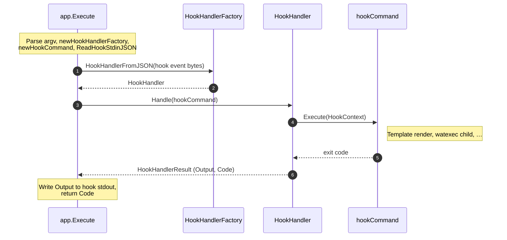
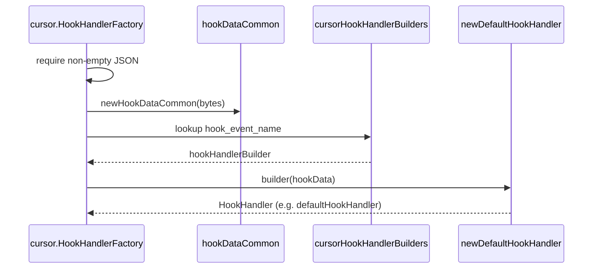
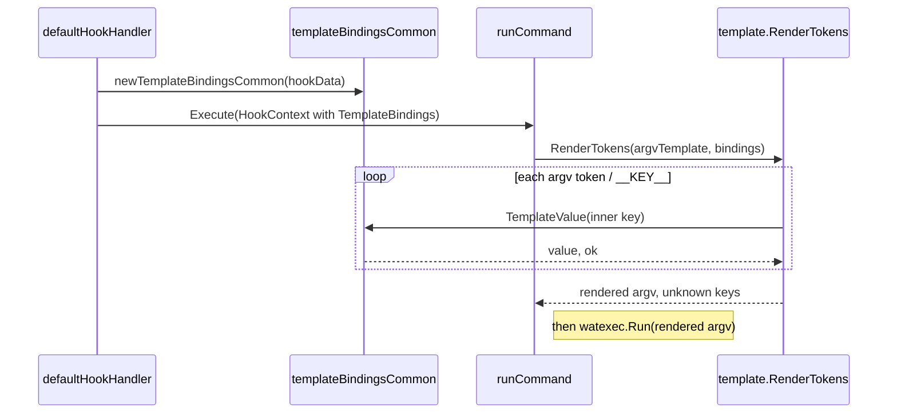

# wat

**wat** is a small tool that accelerates hook writing by taking care of common boilerplate. It reads hook input, passes its data to templated commands or guards, and writes result back to host. It is meant to be:

- **Cross-platform** — runs on Linux, macOS, and Windows.
- **Fast and lightweight** — implemented in Go to have minimal runtime delay.

## Usage

Sample **Cursor** hook configuration (`.cursor/hooks.json`). Adjust the path to `wat` and the child command for your setup.

```json
{
  "version": 1,
  "hooks": {
    "afterFileEdit": [
      {
        "command": "wat run echo __HOOK_EVENT_NAME__"
      }
    ]
  }
}
```

### `wat run`

Run a templated hook subprocess: read hook JSON from stdin, substitute allowed `__PLACEHOLDER__` tokens in the command template, run that process, and write the host’s hook protocol line on success.

```text
Usage:

	wat run <command> [templated arguments]
	wat run --host <name> <command> [templated arguments]
	wat run -H <name> <command> [templated arguments]

Options:

	-H, --host <name>    Hook host that handles stdin and hook protocol
	                      output (default: cursor)
```

Put **`-H` / `--host` and its value after `run` and before the subprocess command** (for example `wat run -H cursor …`). The short form is **`-H`** (not `-h`). If the same option is passed more than once, **the last value wins**.

**Command template** — Everything after the optional flags is one command template: the subprocess program and its arguments. Use only `__PLACEHOLDER__` tokens from [Common Cursor placeholders](#common-cursor-placeholders); any other `__TOKEN__` in the template is an error (exit code `2`).

**Exit status** — If the subprocess is started, wat exits with **that process’s exit code**. Otherwise wat uses own standard [Exit codes](#exit-codes).

### Exit codes

| Code | Meaning |
|------|---------|
| `0` | Success. For `run`, also means that templated command ran and exited `0`. |
| `1` | General failure — e.g. stdin JSON parse error, host/event rejected the payload, or the subprocess failed to run. |
| `2` | Bad input — invalid CLI usage, unknown host, unknown subcommand, missing `run` command, unknown `__PLACEHOLDER__`, or nothing left to execute after templating. |

If `run` **does** start a subprocess, the process exit code may match the child’s code, so `1` or `2` can mean either wat or the child; check stderr for context.

## Supported hosts

- **[Cursor](#cursor)** — supported today.

## Cursor

Cursor supplies hook JSON on stdin. Register hook commands in **`.cursor/hooks.json`**.

### Common Cursor placeholders

| Placeholder | Description |
|-------------|-------------|
| `__CONVERSATION_ID__` | Identifier for the current conversation; taken from the `conversation_id` property of the stdin JSON. |
| `__GENERATION_ID__` | Identifier for the generation step; taken from `generation_id`. |
| `__MODEL__` | Model name for the interaction; taken from `model`. |
| `__HOOK_EVENT_NAME__` | Which hook fired (for example `afterFileEdit`); taken from `hook_event_name`. |
| `__CURSOR_VERSION__` | Cursor app version string; taken from `cursor_version`. |
| `__WORKSPACE_ROOTS__` | Workspace root paths as a single string, joined with `;`; taken from the `workspace_roots` JSON array on stdin. |
| `__USER_EMAIL__` | Signed-in user email when present; taken from `user_email` (empty string if missing or `null`). |
| `__TRANSCRIPT_PATH__` | Transcript file path when present; taken from `transcript_path` (empty string if missing or `null`). |

### Supported Cursor hook types

For `wat run`, the default handler runs your templated subprocess; placeholders are only those in [Common Cursor placeholders](#common-cursor-placeholders).

#### `afterShellExecution`

Fires after a shell command runs in Cursor.

**Returns** `{}`.

#### `afterMCPExecution`

Fires after MCP execution.

**Returns** `{}`.

#### `afterFileEdit`

Fires after a file edit.

**Returns** `{}`.

#### `afterTabFileEdit`

Fires after a tab file edit.

**Returns** `{}`.

#### `afterAgentResponse`

Fires after an agent response.

**Returns** `{}`.

#### `afterAgentThought`

Fires after agent thought.

**Returns** `{}`.

#### `sessionEnd`

Fires when the session ends.

**Returns** `{}`.

## Development

Requires Go 1.26+ (see `go.mod`).

```bash
go test ./...
go vet ./...
go build ./cmd/wat
go build -o ./bin/ ./cmd/wat
```

CI runs `go test ./...`, `go vet ./...`, and `go build ./cmd/wat` across multiple `GOOS`/`GOARCH` targets.

### Versioning

This project follows [Semantic Versioning 2.0.0](https://semver.org/) and maintains a [Keep a Changelog](https://keepachangelog.com/en/1.1.0/) in `CHANGELOG.md`.

## Architecture overview

wat is layered so **hosts** (Cursor today) stay separate from **shared** CLI, templating, and subprocess execution.

### Core interfaces (`internal/core`)

These types define the host-neutral contract:

- **`HookHandlerFactory`** — Builds a `HookHandler` from raw hook stdin JSON bytes. The host chooses parsing, validation, and which events exist.
- **`HookHandler`** — Handles one invocation: receives the subcommand `Command`, fills `HookContext` (including `TemplateBindings`), calls `Command.Execute`, and returns `HookHandlerResult` (process exit `Code` and hook stdout `Output` string).
- **`Command`** — Subcommand implementation (`run` today): `Execute(ctx *HookContext) int` using `ctx.TemplateBindings`, returning the process exit code.
- **`TemplateBindings`** — `TemplateValue(key) (value, ok)` for keys matching the inner part of `__KEY__` in argv (see `internal/template`). If `ok` is false, `run` reports an unknown placeholder error.
- **`HookContext`** — Carries `TemplateBindings` into `Command.Execute`; the handler must set bindings before `Execute`.

### Execution flow

1. **Entry** — **`cmd/wat`** `main` calls **`app.Execute`** with argv (minus program name), stdin, stdout, and stderr; **`Execute`** constructs **`cli.Console`** and **`watexec`** runner for the rest of the run.
2. **Setup inside `app.Execute`** (same scope as the diagram note over **`app.Execute`**) — **`parseCommandAndCommonParameters`** (subcommand, `host` / `-H`, command-template argv); **`newHookHandlerFactory(host)`** yields **`HookHandlerFactory`**; **`newHookCommand`** builds **`hookCommand`** (`core.Command`, e.g. **`commands.NewRunCommand`**); **`cli.ReadHookStdinJSON`** reads hook event bytes from stdin.
3. **`app.Execute` → `HookHandlerFactory` → `app.Execute`** — **`HookHandlerFromJSON(hook event bytes)`**; factory parses/validates the event and returns **`HookHandler`** to **`app.Execute`**.
4. **`app.Execute` → `HookHandler`** — **`Handle(hookCommand)`**; the handler sets **`HookContext`** / **`TemplateBindings`**.
5. **`HookHandler` → `hookCommand` → `HookHandler` → `app.Execute`** — **`Execute(HookContext)`** (template render, **`watexec`** child, …) returns the subprocess exit code; **`HookHandler`** returns **`HookHandlerResult`** (**`Output`**, **`Code`**) to **`app.Execute`**.
6. **Finish** (diagram note over **`app.Execute`**) — write **`result.Output`** to hook stdout, return **`result.Code`** as the process exit code.



### Cursor hook factory and handler (`internal/cursor`)

This is how the **`HookHandlerFactory`** and **`HookHandler`** from the execution flow are implemented for Cursor today.

1. **Factory value** — **`cursor.NewHookHandlerFactory()`** returns **`cursor.HookHandlerFactory`**, a stateless type that implements **`core.HookHandlerFactory`**.
2. **`HookHandlerFromJSON`** — Rejects empty stdin (Cursor expects a JSON body). **`newHookDataCommon`** unmarshals bytes into **`hookDataCommon`** (shared envelope: `conversation_id`, `hook_event_name`, etc.—see `hook_data_common.go`).
3. **Per-event dispatch** — **`hook_event_name`** selects an entry in **`cursorHookHandlerBuilders`** (`hook_handler_builders.go`). Missing events return an error (“not supported yet”).
4. **Building the handler** — Each registered builder is a **`hookHandlerBuilder`** `func(hookData hookDataCommon) (core.HookHandler, error)`. Today every supported event uses **`newDefaultHookHandler`**, which returns **`defaultHookHandler`** (`handler_default.go`) holding the parsed **`hookDataCommon`**.
5. **`defaultHookHandler.Handle`** — Builds **`HookContext`** whose **`TemplateBindings`** come from **`newTemplateBindingsCommon(hookData)`**, calls **`cmd.Execute(ctx)`**, and returns **`HookHandlerResult`** with the subprocess exit **`Code`** and fixed hook stdout **`Output`** (**`defaultHookResponseLine`**, i.e. `{}` plus newline).
6. **`TemplateBindings` wiring (`template_bindings_common.go`)** — **`newTemplateBindingsCommon`** wraps **`hookDataCommon`** in **`templateBindingsCommon`**, which implements **`core.TemplateBindings`**. **`TemplateValue(placeholderKey)`** looks up **`placeholderKey`** in **`commonPlaceholderExtractors`**: keys are the **inner** names only (**`CONVERSATION_ID`**, **`HOOK_EVENT_NAME`**, …—the same strings **`internal/template`** extracts from **`__KEY__`** tokens). Each map entry is a small function that reads one field from the embedded **`hookDataCommon`** (optional JSON uses **`helpers.StringFromPtr`**; **`workspace_roots`** is joined with **`;`**). If the key is missing from the map, **`TemplateValue`** returns **`ok == false`** (unknown placeholder for `run`). If the key is known, **`ok == true`** even when the substituted string is empty (e.g. null optional fields).
7. **Where bindings run** — For **`wat run`**, **`commands.runCommand.Execute`** calls **`template.RenderTokens(argvTemplate, ctx.TemplateBindings)`** (`internal/template`). **`RenderTokens`** scans each argv token for **`__KEY__`** substrings, calls **`TemplateValue`** per key, substitutes the returned string, and collects unknown keys; **`run`** turns any unknowns into a bad-input exit.





### Other packages

- **`internal/cli`** — Console (stderr vs hook stdout), help text, exit code constants, shared hook stdin JSON read.
- **`internal/commands`** — Subcommands as `core.Command` (e.g. `run`).
- **`internal/template`** — Replaces `__KEY__` tokens using `TemplateBindings`.
- **`internal/watexec`** — Subprocess runner (child stderr forwarded; child stdout discarded).
- **`internal/helpers`** — Small shared utilities.

### Extending wat

- **New host** — Add a package (like `internal/cursor`) implementing `HookHandlerFactory`, own JSON types, default hook stdout lines, and stdin policy. Register the factory in `app.newHookHandlerFactory`. Keep host protocol strings out of `internal/cli`.
- **New hook (event)** — For an existing host, register `hook_event_name` in that host’s handler-builder map (e.g. `cursorHookHandlerBuilders` in `internal/cursor/hook_handler_builders.go`), wiring an existing or new builder to a `HookHandler`. If the JSON shape or placeholders differ, extend the host’s payload types and `TemplateBindings` as needed; document the event in the README.
- **New subcommand** — Implement `core.Command` in `internal/commands` and wire argv construction in `app.newHookCommand`.
