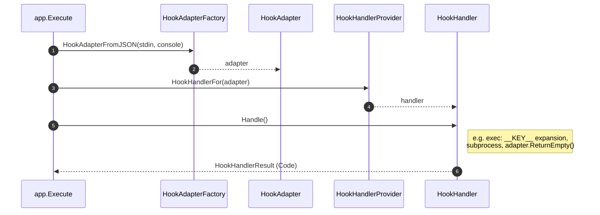

# wat

**wat** is a small tool that accelerates hook writing by taking care of common boilerplate. It reads hook input, passes its data to templated commands or guards, and writes result back to host. It is meant to be:

- **Cross-platform** — runs on Linux, macOS, and Windows.
- **Fast and lightweight** — implemented in Go to have minimal runtime delay.

## Usage

Sample **Cursor** hook configuration (`.cursor/hooks.json`). Adjust the path to `wat` and the child command for your setup.

```json
{
  "version": 1,
  "hooks": {
    "afterFileEdit": [
      {
        "command": "wat cursor exec echo __HOOK_EVENT_NAME__"
      }
    ]
  }
}
```

### `wat <host> exec`

Run a templated hook subprocess: read hook JSON from stdin, substitute allowed `__PLACEHOLDER__` tokens in the command template, run that process, and write the host’s hook protocol line on success. The **first** argument is the hook host (e.g. `cursor`); the **second** is the wat subcommand (`exec`).

```text
Usage:

	wat <host> exec <command> [templated arguments]
	wat <host> exec [-f <re>] <command> [templated arguments]
	wat <host> exec [--file-pattern <re>] <command> [templated arguments]

Options (only for exec, before the subprocess template):

	-f, --file-pattern <re>
	                      Optional; default * means no filter. If you pass a
	                      non-* value, <re> must be non-empty (Go regexp syntax).
	                      When stdin bindings include __FILE_PATH__ (Cursor
	                      afterFileEdit or afterTabFileEdit), `exec` skips the subprocess if the path
	                      does not match <re>; other hook events ignore the flag
	                      for matching purposes.
```

Put `-f` / `--file-pattern` after `exec` and before the subprocess command (for example `wat cursor exec -f '[.]go$' …`). Flags are parsed when **`execcommand.NewExecHookHandlerProvider`** builds the provider. If equivalent options are repeated, **the last value wins**.

**Command template** — Everything after the optional flags is one command template: the subprocess program and its arguments. Use only `__PLACEHOLDER__` tokens documented under [Cursor exec template bindings](#cursor-exec-template-bindings); any other `__TOKEN__` in the template is an error (exit code `2`).

#### Cursor exec template bindings

Authoritative list of `__KEY__` segments for `wat cursor exec` (inner part between underscores). Optional JSON fields resolve to an empty string when missing or `null`.

**Common** — Available for every Cursor hook event that `exec` supports (including events that use the default adapter):

| Placeholder | Description |
|-------------|-------------|
| `__CONVERSATION_ID__` | From `conversation_id`. |
| `__GENERATION_ID__` | From `generation_id`. |
| `__MODEL__` | From `model`. |
| `__HOOK_EVENT_NAME__` | From `hook_event_name`. |
| `__CURSOR_VERSION__` | From `cursor_version`. |
| `__USER_EMAIL__` | From `user_email` when present (empty if missing or `null`). |
| `__TRANSCRIPT_PATH__` | From `transcript_path` when present (empty if missing or `null`). |

**Per event** — `exec` adds event-specific keys only when the hook adapter carries that data ([`exec_hook_handler_provider.go`](internal/execcommand/exec_hook_handler_provider.go)):

| Event | Additional placeholders |
|-------|-------------------------|
| `afterFileEdit`, `afterTabFileEdit` | `__FILE_PATH__` |
| `afterShellExecution` | `__DURATION__`, `__SANDBOX__` |
| `afterMCPExecution` | `__TOOL_NAME__`, `__DURATION__` |
| `afterAgentThought` | `__DURATION_MS__` |
| `afterAgentResponse`, `sessionEnd`, and other events that use the default adapter | None — common placeholders only. |

The built-in `wat … exec` help lists the union of placeholders across events; use the table above to see which tokens apply to the hook you are configuring.

**Exit status** — If the subprocess is started, wat exits with **that process’s exit code**. Otherwise wat uses own standard [Exit codes](#exit-codes).

### Exit codes

| Code | Meaning |
|------|---------|
| `0` | Success. For `exec`, this means the templated command exited `0`, or `exec` skipped the subprocess because `-f` / `--file-pattern` did not match `__FILE_PATH__`. |
| `1` | General failure — e.g. stdin JSON parse error, host/event rejected the payload, or the subprocess failed to run. |
| `2` | Bad input — invalid CLI usage, unknown host, unknown subcommand, missing `exec` command, unknown `__PLACEHOLDER__`, or nothing left to execute after templating. |

If `exec` **does** start a subprocess, the process exit code may match the child’s code, so `1` or `2` can mean either wat or the child; check stderr for context.

## Supported hosts

- **[Cursor](#cursor)** — supported today.

## Cursor

Cursor supplies hook JSON on stdin. Register hook commands in **`.cursor/hooks.json`**.

Shared and event-specific field types are defined in [`internal/cursor/hook_data.go`](internal/cursor/hook_data.go). Every event receives the shared **`HookDataCommon`** envelope (`conversation_id`, `generation_id`, `model`, `hook_event_name`, `cursor_version`, `workspace_roots`, optional `user_email`, optional `transcript_path`).

### Supported Cursor hook types

Each subsection describes what the **hook adapter** exposes from stdin for that `hook_event_name` (not which `exec` placeholders exist—see [Cursor exec template bindings](#cursor-exec-template-bindings)).

#### `afterShellExecution`

Fires after a shell command runs. **`AfterShellExecutionFields`** adds `command`, `output`, `duration`, and `sandbox` to the shared envelope.

**Returns** `{}`.

#### `afterMCPExecution`

Fires after MCP execution. **`AfterMCPExecutionFields`** adds `tool_name`, `tool_input`, `result_json`, and `duration` (milliseconds spent executing the tool, excluding approval wait time) to the shared envelope.

**Returns** `{}`.

#### `afterFileEdit`

Fires after a file edit. **`AfterFileEditFields`** adds `file_path` and `edits` (each edit is `old_string` / `new_string`).

**Returns** `{}`.

When `wat cursor exec …` includes `-f` / `--file-pattern` with a Go regexp, **`execcommand.NewExecHookHandlerProvider`** (in `internal/execcommand`) builds handlers for **afterFileEdit** and **afterTabFileEdit** that apply the filter before invoking the subprocess when `__FILE_PATH__` is present in template bindings (other events omit that key, so the subprocess runs as usual). The regexp is matched against the hook’s `file_path` after path cleaning and normalizing separators to `/`.

#### `afterTabFileEdit`

Fires after Tab (inline completion) edits a file—not Agent edits. Uses the same adapter and exec behavior as **`afterFileEdit`**: **`AfterFileEditFields`** with `file_path` and `edits`. Each edit includes `old_string` / `new_string`; Tab payloads may also include `range` (`start_line_number`, `start_column`, `end_line_number`, `end_column`), `old_line`, and `new_line` for precise tracking.

**Returns** `{}`.

File-pattern filtering with `-f` / `--file-pattern` matches **`afterFileEdit`** (same `__FILE_PATH__` binding).

#### `afterAgentResponse`

Fires after the agent completes an assistant message. **`AfterAgentResponseFields`** adds `text` to the shared envelope. `wat cursor exec` exposes common placeholders only (not `text`).

**Returns** `{}`.

#### `afterAgentThought`

Fires after the agent completes a thinking block. **`AfterAgentThoughtFields`** adds `text` and `duration_ms` to the shared envelope. For `exec`, **`__DURATION_MS__`** is bound from `duration_ms`; `text` is not exposed as a template placeholder.

**Returns** `{}`.

#### `sessionEnd`

Fires when the session ends. Uses the default adapter (**`HookDataCommon`** only).

**Returns** `{}`.

## Development

Requires Go 1.26+ (see `go.mod`).

```bash
go test ./...
go vet ./...

# Local hook binary at repo root (gitignored; match the real filename in `.cursor/hooks.json`)
# Omit -o on Windows so the toolchain writes wat.exe in the current directory.
go build ./cmd/wat

# Build under bin/ (use a .exe suffix on Windows when using -o; -o uses the path literally)
go build -o bin/wat.exe ./cmd/wat
```

On **Windows**, `-o` is interpreted literally: `go build -o wat …` creates a file named `wat` with **no** `.exe`, which is a poor fit for hooks and `CreateProcess`.

- Prefer **`go build ./cmd/wat`** from the repo root (no `-o`) so the output is **`wat.exe`**, and point hooks at **`.\wat.exe`**.
- If you must pass `-o`, use **`-o wat.exe`**.

On **Unix**, `go build ./cmd/wat` writes **`wat`** in the current directory; use **`./wat`** in hooks.

CI runs `go test ./...`, `go vet ./...`, and `go build ./cmd/wat` across multiple `GOOS`/`GOARCH` targets.

### Versioning

This project follows [Semantic Versioning 2.0.0](https://semver.org/) and maintains a [Keep a Changelog](https://keepachangelog.com/en/1.1.0/) in `CHANGELOG.md`.

## Architecture overview

wat separates **hook hosts** (Cursor today) from shared CLI wiring in **`internal/app`**, host-neutral types in **`internal/core`**, and subcommands such as **`internal/execcommand`** (`exec`). Hosts own JSON shapes and how stdin is validated; **`exec`** maps **`HookAdapter`** values to placeholder bindings and subprocess execution.

### Host-neutral contract (`internal/core`)

| Role | Responsibility |
|------|----------------|
| **`HookAdapter`** | One parsed hook invocation: `HookHost()`, plus `ReturnEmpty()` to write the default hook protocol line (e.g. Cursor `"{}\n"`) via the `cli.Console` captured when the adapter was built. |
| **`HookAdapterFactory`** | Builds a `HookAdapter` from stdin JSON (`HookAdapterFromJSON(hookEventJSON, console)`). |
| **`HookHandlerProvider`** | Subcommand configuration; picks a `HookHandler` with `HookHandlerFor(hook HookAdapter)`. |
| **`HookHandler`** | Runs one invocation: `Handle()` → `HookHandlerResult`. |
| **`HookHandlerResult`** | Process exit `Code` only. Hook stdout is **not** part of this struct; handlers call `HookAdapter.ReturnEmpty()` so protocol output stays on the adapter/console path. |

Failures before a handler runs (unknown host, stdin JSON error, unsupported adapter for the subcommand) go to **stderr** only; hook stdout stays empty. After `Handle()`, `app.Execute` returns `result.Code` only.

### Runtime pipeline

1. **`cmd/wat`** calls **`app.Execute`** with program args, stdin, stdout, stderr; **`cli.NewConsole`** routes diagnostics to stderr and hook protocol output to stdout.
2. **Host** — Parse `wat <host> …`; **`app.newHookAdapterFactory`** returns a **`HookAdapterFactory`** (e.g. **`cursor.NewHookAdapterFactory()`**).
3. **Stdin** — **`cli.ReadHookStdinJSON`** reads bytes; **`HookAdapterFromJSON`** builds a **`HookAdapter`**. Cursor requires a non-empty JSON object.
4. **Subcommand** — Parse `wat <host> <subcommand> …`; **`app.newHookHandlerProvider`** returns a **`HookHandlerProvider`** (e.g. **`execcommand.NewExecHookHandlerProvider`**, which parses **`exec`** flags such as **`-f`** from the remaining args).
5. **Run** — **`HookHandlerFor(adapter)`** then **`Handle()`** → **`HookHandlerResult`**; **`app.Execute`** returns **`Code`**.



### Cursor (`internal/cursor`)

- **`HookAdapterFactory.HookAdapterFromJSON`** — Rejects empty stdin; **`NewHookDataCommon`** parses the shared envelope ([`hook_data.go`](internal/cursor/hook_data.go)).
- **`cursorHookAdapterBuilders`** — Maps **`hook_event_name`** to a **`HookAdapterBuilder`** ([`hook_adapter_builders.go`](internal/cursor/hook_adapter_builders.go)). Each builder returns a concrete adapter (e.g. **`DefaultCursorHookAdapter`**, **`AfterFileEditCursorHookAdapter`**, **`AfterShellExecutionCursorHookAdapter`**, **`AfterMCPExecutionCursorHookAdapter`** — see [`cursor_hook_adapter.go`](internal/cursor/cursor_hook_adapter.go)).
- Parsed data lives on the adapter as **`CommonInput`** (`HookDataCommon`) and optional **`EventSpecificInput`** (`*T`). The struct **`CursorHookRunData[T]`** documents the same common-plus-event layout for tests and helpers.

### `exec` (`internal/execcommand`)

- **`NewExecHookHandlerProvider`** parses the command template and optional **`-f` / `--file-pattern`**, then **`HookHandlerFor`** dispatches on concrete Cursor adapter types ([`exec_hook_handler_provider.go`](internal/execcommand/exec_hook_handler_provider.go)).
- Handlers build **`templateBindings`** ([`cursor_bindings_common.go`](internal/execcommand/cursor_bindings_common.go), [`cursor_bindings_event.go`](internal/execcommand/cursor_bindings_event.go), and per-event helpers), substitute **`__KEY__`** segments, run **`runSubprocess`** (child stderr via **`Console.ConnectErrorsFrom`**), and call **`hook.ReturnEmpty()`** ([`exec_hook_handler_base.go`](internal/execcommand/exec_hook_handler_base.go)). **`afterFileEdit`** and **`afterTabFileEdit`** apply the file-pattern filter only when that adapter type is used ([`exec_hook_handler_after_file_edit.go`](internal/execcommand/exec_hook_handler_after_file_edit.go)).

### Other packages

- **`internal/cli`** — Console, shared hook stdin JSON read, help, exit code constants.
- **`internal/helpers`** — Small utilities (e.g. optional string fields in bindings).

### Extending wat

- **New host** — Implement **`HookAdapterFactory`** and hook stdout policy (`ReturnEmpty`). Register in **`app.newHookAdapterFactory`**. Keep host-specific protocol strings in the host package, not scattered through **`cli`**.
- **New Cursor event** — Register **`hook_event_name`** in **`cursorHookAdapterBuilders`** and return the right concrete **`HookAdapter`**. If **`exec`** needs new **`__KEY__`** tokens, extend **`HookHandlerFor`** and bindings.
- **New wat subcommand** — Implement **`HookHandlerProvider`** under **`internal/<name>`** and wire **`app.newHookHandlerProvider`**.
